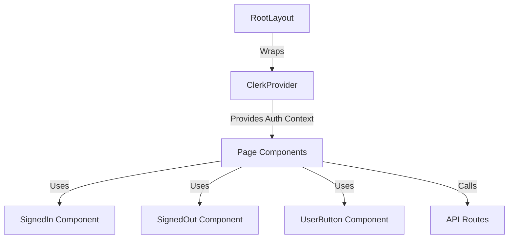
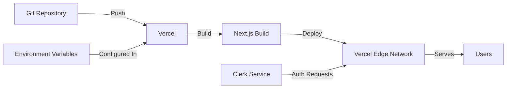

# TimTracker2 Architecture

## System Overview

TimTracker2 is a Next.js application using the App Router pattern with Clerk for authentication. The application follows a server-side rendering approach with API routes for backend functionality.

## Application Structure

### Middleware Layer

The `middleware.ts` file runs on every request and:
- Defines public routes (/, /api/hello, /sign-in, /sign-up)
- Protects all other routes
- Redirects unauthenticated users to sign-in
- Passes authentication context to pages

### App Router Structure

```
app/
├── layout.tsx          # Root layout with ClerkProvider
├── page.tsx            # Home page (public)
├── api/
│   └── hello/
│       └── route.ts    # Example API route
├── sign-in/
│   └── [[...sign-in]]/ # Clerk catch-all sign-in route
│       └── page.tsx
└── sign-up/
    └── [[...sign-up]]/ # Clerk catch-all sign-up route
        └── page.tsx
```

### Component Architecture



## Key Design Decisions

### 1. Clerk for Authentication
- **Rationale**: Reduces auth complexity, provides pre-built UI components
- **Impact**: All auth flows go through Clerk's service
- **Trade-offs**: External dependency, but saves development time

### 2. Next.js App Router
- **Rationale**: Modern React patterns, better performance, server components
- **Impact**: File-based routing, server components by default
- **Trade-offs**: Learning curve, but better long-term maintainability

### 3. Monorepo Structure
- **Rationale**: Allows for future expansion (mobile app, admin panel, etc.)
- **Impact**: Workspace-based dependency management
- **Trade-offs**: Slightly more complex setup, but better scalability

### 4. Middleware-Based Route Protection
- **Rationale**: Centralized auth logic, runs before page load
- **Impact**: All routes automatically protected unless explicitly public
- **Trade-offs**: Must remember to add new public routes to matcher

## API Design

### Current API Routes

- `GET /api/hello` - Example public API endpoint

### API Route Pattern

```typescript
// app/api/[route]/route.ts
export async function GET(request: Request) {
  // Handler logic
  return NextResponse.json({ data });
}
```

## Environment Configuration

### Required Variables

- `NEXT_PUBLIC_CLERK_PUBLISHABLE_KEY` - Public Clerk key (exposed to client)
- `CLERK_SECRET_KEY` - Secret Clerk key (server-only)

### Configuration Files

- `next.config.mjs` - Next.js configuration
- `vercel.json` - Vercel deployment configuration
- `tsconfig.json` - TypeScript configuration

## Deployment Architecture



## Future Considerations

- Database integration (PostgreSQL, MongoDB, etc.)
- State management (if needed: Zustand, Redux, etc.)
- API layer abstraction (tRPC, GraphQL, REST)
- Real-time features (WebSockets, Server-Sent Events)
- File storage (S3, Cloudinary, etc.)

## Security Considerations

1. **Authentication**: All protected routes verified via Clerk middleware
2. **API Routes**: Should verify auth tokens even if behind middleware
3. **Environment Variables**: Never commit secrets, use Vercel env vars
4. **CORS**: Configure appropriately for API routes if needed
5. **Rate Limiting**: Consider adding for API routes in production

