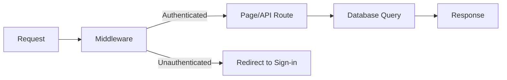
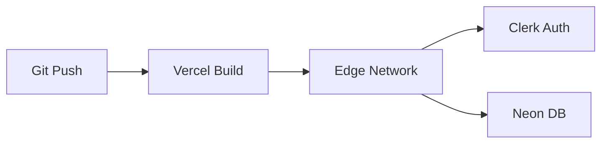

# TimTracker2 Architecture

## Overview

Next.js 14 App Router application with Clerk authentication and Neon PostgreSQL. Server-side rendering by default, with API routes for backend logic.

## Key Design Decisions

### Middleware-Based Route Protection
- `middleware.ts` runs on every request
- All routes protected unless explicitly marked public
- Public routes: `/`, `/api/hello`, `/sign-in`, `/sign-up`
- **Important**: Update middleware when adding new public routes

### Clerk Authentication
- Pre-built UI components (`<SignedIn>`, `<SignedOut>`, `<UserButton>`)
- Server: `auth()` from `@clerk/nextjs/server`
- Client: `useAuth()` hook from `@clerk/nextjs`

### Database Access
- `lib/db.ts` provides connection pool to Neon PostgreSQL
- Uses `pg` with SSL and connection pooling for serverless
- All queries server-side only

## Request Flow

## Deployment

- Vercel handles builds and edge deployment
- Environment variables configured in Vercel dashboard
- See README.md for required env vars

## Security Considerations

1. **Route Protection**: Middleware verifies auth on all non-public routes
2. **API Routes**: Always verify auth tokens, even behind middleware
3. **Database**: All queries server-side, never exposed to client
4. **Secrets**: Never commit; use Vercel env vars
5. **Rate Limiting**: Consider adding for production API routes

## Future Considerations

- State management (Zustand if needed)
- Real-time features (WebSockets/SSE)
- File storage (S3, Cloudinary)
- Data visualization/charts
