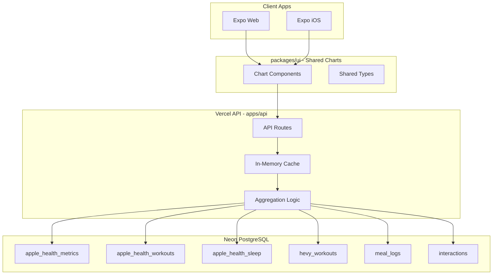

# PRD: Health Dashboard Charts Migration

**Date**: 2026-01-17  
**Author**: Tim Yousaf  
**Status**: In Progress

## Overview

Migrate all health tracking charts from the legacy timtracker webapp to timtracker2, updating them to query the Neon PostgreSQL database via the Vercel API instead of the Cloud Run Flask API.

## Problem Statement

The timtracker2 iOS and web apps currently only display raw health metrics in a table. The legacy timtracker webapp has a comprehensive dashboard with 8 different chart types visualizing health, exercise, sleep, diet, and social data. Users need these visualizations in the new apps to effectively track their health trends.

## Goals

- Replicate all 8 chart types from the legacy webapp
- Support both iOS (React Native) and web platforms with **shared code**
- Implement server-side data aggregation for performance
- Use modern chart libraries (shadcn/ui + ECharts for calendar heatmap)
- Maintain feature parity with the legacy implementation, including **rich tooltips**

## Requirements

### Functional Requirements

1. **Calendar Heatmaps** - Display 5-week calendars for exercise, mindful minutes, meals, and interactions
2. **Sleep Chart** - Bar chart with 7-day moving average line
3. **Health Metric Charts** - Scatter/bar + moving average for body weight, waist, HRV, resting HR, distance
4. **Weekly Workouts** - Stacked bar chart by workout type with max heart rate line
5. **Strength Training Volume** - Weekly bar chart with workout details
6. **Exercise Progress** - Per-exercise volume/weight tracking (8 exercises)
7. **Diet Chart** - Daily meal scores with 7-day moving average
8. **Date Range Selector** - Filter all charts by date range

### Non-Functional Requirements

- **Performance**: API response time < 500ms for aggregated data
- **Security**: All endpoints authenticated via Clerk
- **Caching**: 5-minute server-side cache for expensive aggregations
- **Cross-Platform**: Charts must render natively on both iOS and web
- **Code Sharing**: Chart components shared between iOS and web apps

## Charts Inventory & Layout

The charts are organized exactly as in the legacy TimTracker webapp (`git/timtracker/webapp/src/ChartsPage.tsx`).

**Note:** The Interaction Calendar is on a separate Social page in the legacy app, not the Charts page.

### Section 1: Core Metrics
| # | Chart | Component | Color |
|---|-------|-----------|-------|
| 1 | Daily Sleep | `SleepChart` | Conditional (red < 6h, yellow < 7.5h, green ≥ 7.5h) |
| 2 | Diet (Meal Scores) | `MealScoreChart` | #2196F3 (blue) |
| 3 | Mindful Minutes Calendar | `CalendarHeatmap` | #9C27B0 (purple) |
| 4 | Exercise Calendar | `CalendarHeatmap` | #4CAF50 (green) |
| 5 | Strength Training Volume | `StrengthChart` | Stacked colors |
| 6 | Meal Logging Calendar | `CalendarHeatmap` | #FF9800 (orange) |
| 7 | Waist Circumference | `HealthChart` (scatter) | #C77B7F |
| 8 | Body Weight | `HealthChart` (scatter) | #C77B7F |

### Section 2: Health Details
| # | Chart | Component | Color |
|---|-------|-----------|-------|
| 9 | Resting Heart Rate | `HealthChart` (scatter) | #E91E63 |
| 10 | Heart Rate Variability | `HealthChart` (scatter) | #9C27B0 |
| 11 | Mindful Minutes (bar) | `SimpleBarChart` | #9C27B0 |

### Section 3: Exercise Details
| # | Chart | Component | Color |
|---|-------|-----------|-------|
| 12 | Weekly Workouts | `WorkoutsChart` | Stacked colors + red HR line |
| 13 | Walking + Running Distance | `HealthChart` (bar) | #FF9F40 |

### Section 4: Strength (Exercise Progress)
| # | Chart | Exercise Name |
|---|-------|---------------|
| 14 | Romanian Deadlift (Barbell) | `ExerciseProgressChart` |
| 15 | Bench Press (Barbell) | `ExerciseProgressChart` |
| 16 | Incline Bench Press (Barbell) | `ExerciseProgressChart` |
| 17 | Incline Bench Press (Dumbbell) | `ExerciseProgressChart` |
| 18 | Bent Over Row (Barbell) | `ExerciseProgressChart` |
| 19 | Bulgarian Split Squat | `ExerciseProgressChart` |
| 20 | Lateral Raise (Dumbbell) | `ExerciseProgressChart` |
| 21 | Rear Delt Reverse Fly (Dumbbell) | `ExerciseProgressChart` |

### Separate: Social Page
| Chart | Component | Color |
|-------|-----------|-------|
| Interaction Calendar | `CalendarHeatmap` | #2196F3 (blue) |

## Technical Approach

### Architecture



### API Endpoints

| Endpoint | Method | Description |
|----------|--------|-------------|
| `/api/metrics` | GET | Health metrics with aggregation and moving averages |
| `/api/sleep` | GET | Sleep data with daily totals and moving averages |
| `/api/calendar-heatmap` | GET | 5-week calendar data for exercise/mindful/meal/interaction |
| `/api/weekly-workouts` | GET | Weekly workout aggregation by type |
| `/api/strength-volume` | GET | Weekly strength training volume |
| `/api/exercise-progress` | GET | Per-exercise progress data |
| `/api/daily-totals` | GET | Daily totals for workouts/meals/interactions |
| `/api/daily-meal-scores` | GET | Daily meal scores |
| `/api/interactions` | GET | Interactions list |
| `/api/workouts` | GET | Apple Health workouts |

### API Request/Response Examples

#### GET /api/metrics

```typescript
// Request
GET /api/metrics?type=Weight/Body%20Mass%20(lb)&start=2024-01-01&end=2024-03-31&period=day

// Response
{
  "data": [
    { "date": "2024-01-01", "value": 175.2, "movingAvg": 175.5 },
    { "date": "2024-01-02", "value": 174.8, "movingAvg": 175.3 },
    ...
  ]
}
```

#### GET /api/calendar-heatmap

```typescript
// Request
GET /api/calendar-heatmap?type=exercise&offset=0

// Response
{
  "startDateStr": "December 15",
  "endDateStr": "January 18, 2026",
  "points": [
    {
      "x": 0,  // Sunday
      "y": 0,  // Week 1
      "value": 45,
      "date": "2024-12-15",
      "workouts": [
        { "type": "Running", "durationMinutes": 30, "metrics": {...} }
      ]
    },
    ...
  ]
}
```

#### GET /api/sleep

```typescript
// Request
GET /api/sleep?start=2024-01-01&end=2024-03-31

// Response
{
  "data": [
    { "date": "2024-01-01", "hours": 7.5, "readable": "7 hr 30 min", "movingAvg": 7.2 },
    ...
  ]
}
```

#### GET /api/weekly-workouts

```typescript
// Request
GET /api/weekly-workouts?start=2024-01-01&end=2024-03-31

// Response
{
  "categories": ["1/1 - 1/7/2024", "1/8 - 1/14/2024", ...],
  "series": [
    { "name": "Running", "data": [30, 45, 60, ...], "stack": "total" },
    { "name": "Strength Training", "data": [45, 30, 45, ...], "stack": "total" }
  ],
  "maxHeartRate": [165, 172, 168, ...]
}
```

### Chart Component Structure

Charts are implemented in the shared `packages/ui` package, accessible by both web and iOS apps.

```
packages/ui/
  src/
    index.ts                   # Re-exports all components and types
    charts/
      index.ts                 # Chart exports
      CalendarHeatmap.tsx      # ECharts-based (cross-platform)
      HealthChart.tsx          # shadcn/Recharts ComposedChart
      SleepChart.tsx           # shadcn/Recharts ComposedChart
      WorkoutsChart.tsx        # shadcn/Recharts stacked BarChart
      StrengthChart.tsx        # shadcn/Recharts BarChart
      ExerciseProgressChart.tsx # shadcn/Recharts ComposedChart
      MealScoreChart.tsx       # shadcn/Recharts ComposedChart
      SimpleBarChart.tsx       # shadcn/Recharts BarChart
      ChartCard.tsx            # Container component
    types/
      index.ts                 # Type exports
      charts.ts                # Chart data types
      api.ts                   # API response types
apps/expo/
  app/(tabs)/charts.tsx        # Charts dashboard page
  lib/api.ts                   # API client functions
```

### Data Aggregation Strategy

**Server-side aggregation** is preferred for:
1. **DRY** - Same logic serves both web and iOS
2. **Performance** - Reduce data transfer (send aggregated, not raw data)
3. **Consistency** - Both platforms see identical data

**Implementation approach:**
- Use PostgreSQL `GROUP BY` and window functions for basic aggregations
- Use TypeScript for complex logic (moving averages, week boundaries)
- Cache results in-memory for 5 minutes

Example aggregation (from legacy Flask):
```typescript
// Calculate 7-day centered moving average
function calculateMovingAvg(data: {date: string, value: number}[]): {date: string, value: number, movingAvg: number}[] {
  return data.map((point, i) => {
    const start = Math.max(0, i - 3);
    const end = Math.min(data.length, i + 4);
    const window = data.slice(start, end);
    const avg = window.reduce((sum, p) => sum + p.value, 0) / window.length;
    return { ...point, movingAvg: avg };
  });
}
```

## Design Decisions

### Decision 1: Chart Library Selection

**Context**: Need charts that work natively on both web and React Native (iOS).

**Options Considered**:
- **Option A**: shadcn/ui charts (Recharts) + ECharts for calendar heatmap
- **Option B**: Victory Native for everything
- **Option C**: react-native-gifted-charts for everything
- **Option D**: ECharts for everything

**Decision**: Option A - shadcn/ui charts (Recharts) + ECharts for calendar heatmap

**Rationale**:
- shadcn is already the design system for the app
- Recharts works on web via Expo Web
- ECharts (via `react-native-echarts`) provides a cross-platform calendar heatmap that works identically on iOS and web
- ECharts calendar heatmap example: https://echarts.apache.org/examples/en/editor.html?c=calendar-heatmap

**Trade-offs**: Two charting libraries in the codebase, but ECharts is only used for the calendar heatmap component.

### Decision 2: Server-Side vs Client-Side Aggregation

**Context**: Need to aggregate raw health data into chart-ready format.

**Options Considered**:
- **Option A**: Server-side aggregation in API
- **Option B**: Client-side aggregation in app
- **Option C**: Hybrid (simple on server, complex on client)

**Decision**: Option A - Server-side aggregation

**Rationale**:
- Single source of truth for both iOS and web
- Reduces data transfer (especially for large datasets)
- Matches legacy Flask implementation patterns
- Easier to cache aggregated results

### Decision 3: Chart Component Location (Shared Code)

**Context**: Where should chart components live in the monorepo? User requires shared implementations between web and iOS.

**Options Considered**:
- **Option A**: New `packages/ui` shared package
- **Option B**: Inside `apps/expo/components` (web uses same via Expo Web)

**Decision**: Option A - New `packages/ui` shared package

**Rationale**:
- Explicit sharing of chart components and types
- Clear separation of concerns
- Types can be imported by API for response typing
- Future-proof for additional apps

**Package Structure**:
```
packages/
  ui/
    package.json
    src/
      index.ts              # Re-exports all components
      charts/
        index.ts            # Chart exports
        CalendarHeatmap.tsx # ECharts-based
        HealthChart.tsx     # shadcn/Recharts
        SleepChart.tsx
        WorkoutsChart.tsx
        StrengthChart.tsx
        ExerciseProgressChart.tsx
        MealScoreChart.tsx
        ChartCard.tsx       # Container component
      types/
        index.ts            # Type exports
        charts.ts           # All chart-related types
        api.ts              # API response types
```

## Tooltip Specifications

Each chart must replicate the rich tooltip content from the legacy app. Below is the exact content and format for each chart's tooltip.

### Calendar Heatmap Tooltips

**Exercise Calendar:**
```
┌─────────────────────────────────────┐
│ 1/15/2026                           │
│ 45 minutes                          │
│                                     │
│ Workouts:                           │
│ Running: 30 min, avg 145 bpm,       │
│   max 172 bpm                       │
│ Strength Training: 15 min           │
└─────────────────────────────────────┘
```
- **Fields**: Date, total minutes, workouts list (sorted by duration desc)
- **Per workout**: type, duration (rounded), avg heart rate, max heart rate

**Interaction Calendar:**
```
┌─────────────────────────────────────┐
│ 1/15/2026                           │
│ 3 interactions                      │
│                                     │
│ Interactions:                       │
│ John Smith, Phone Call, Caught up   │
│ Jane Doe, In Person                 │
│ Bob Wilson, Text                    │
└─────────────────────────────────────┘
```
- **Fields**: Date, count, interactions list
- **Per interaction**: person name, interaction type, note (if present)

**Meal Calendar:**
```
┌─────────────────────────────────────┐
│ 1/15/2026                           │
│ 3 meals                             │
│                                     │
│ Meals:                              │
│ Oatmeal with berries                │
│ Grilled chicken salad               │
│ Salmon with vegetables              │
└─────────────────────────────────────┘
```
- **Fields**: Date, count, meals list with descriptions

**Mindful Calendar:**
```
┌─────────────────────────────────────┐
│ 1/15/2026                           │
│ 15 minutes                          │
└─────────────────────────────────────┘
```
- **Fields**: Date, total minutes only

### Sleep Chart Tooltip

```
┌─────────────────────────────────────┐
│ 1/15                                │
│ Time slept: 7 hr 30 min             │
│ 7-Day Avg: 7.2                      │
└─────────────────────────────────────┘
```
- **Fields**: Date (M/D format), time slept (human-readable), 7-day average

### Health Chart Tooltip (Generic)

```
┌─────────────────────────────────────┐
│ 2026-01-15                          │
│ Body Weight: 175.2 lbs              │
│ 7-day Moving Average: 175.5 lbs    │
└─────────────────────────────────────┘
```
- **Fields**: Date (ISO format), value with unit (1 decimal), moving average with unit

### Weekly Workouts Tooltip

```
┌─────────────────────────────────────┐
│ 1/6 - 1/12/2026                     │
│ Total Minutes: 180                  │
│ Running: 60 minutes                 │
│ Strength Training: 45 minutes       │
│ Cycling: 45 minutes                 │
│ HIIT: 30 minutes                    │
│ Max Heart Rate: 172 bpm             │
└─────────────────────────────────────┘
```
- **Fields**: Week range, total minutes (bold), breakdown by workout type, max heart rate (red)

### Strength Training Volume Tooltip

```
┌─────────────────────────────────────┐
│ 1/6 - 1/12/2026                     │
│ 45,000 lbs                          │
│ Mon 1/6 Push Day 45 min 12 sets     │
│   48 reps 15,000 lbs                │
│ Wed 1/8 Pull Day 50 min 15 sets     │
│   60 reps 18,000 lbs                │
│ Fri 1/10 Legs 40 min 10 sets        │
│   40 reps 12,000 lbs                │
└─────────────────────────────────────┘
```
- **Fields**: Week range, total volume, per-workout breakdown
- **Per workout**: date (short), title, duration, sets, reps, volume

### Exercise Progress Tooltip

```
┌─────────────────────────────────────┐
│ 2026-01-15                          │
│ Total Volume: 4,500                 │
│ Max Weight: 225 lbs (reps: 5 max,   │
│   12 total)                         │
│ Set 1: 8 reps x 185 lbs             │
│ Set 2: 6 reps x 205 lbs             │
│ Set 3: 5 reps x 225 lbs             │
│ Set 4: 4 reps x 225 lbs             │
└─────────────────────────────────────┘
```
- **Fields**: Date, total volume/reps, max weight with rep info, per-set breakdown
- **Per set**: set number, reps, weight

### Diet/Meal Score Tooltip

```
┌─────────────────────────────────────┐
│ 2026-01-15                          │
│ Daily Score: 8                      │
│ Good protein intake today           │
│                                     │
│ Meals                               │
│ Oatmeal with berries                │
│ Grilled chicken salad               │
│ Salmon with vegetables              │
└─────────────────────────────────────┘
```
- **Fields**: Date, daily score, health comment (if present), meals list

### Tooltip Styling Requirements

- **Background**: White with light border (#ccc)
- **Padding**: 10px
- **Font**: System font, 12px base
- **Bold**: Date headers, totals, section labels
- **Colors**: Red for heart rate, blue for primary metrics
- **Mobile**: Tap to show (vs hover on web)

## Implementation Plan

### Phase 1: Infrastructure ✅
- [x] Create `packages/ui` shared package structure
- [x] Create API utilities (`lib/cache.ts`, `lib/aggregation.ts`)
- [x] Set up TypeScript types (`types/api.ts`, `types/charts.ts`)

### Phase 2: API Endpoints
- [x] `/api/metrics` - Health metrics with aggregation
- [ ] `/api/sleep` - Sleep data (implemented but has 500 error - needs fix)
- [x] `/api/calendar-heatmap` - 5-week calendar data
- [x] `/api/weekly-workouts` - Weekly workout aggregation
- [x] `/api/strength-volume` - Weekly strength training volume
- [x] `/api/exercise-progress` - Per-exercise progress data
- [x] `/api/meal-scores` - Daily meal scores (implemented but may need data)

### Phase 3: Chart Components (packages/ui)
- [x] `ChartCard.tsx` - Container component
- [x] `CalendarHeatmap.tsx` - ECharts-based calendar heatmap
- [x] `HealthChart.tsx` - Generic health metric chart
- [x] `SleepChart.tsx` - Sleep bar chart with moving average
- [x] `WorkoutsChart.tsx` - Stacked weekly workout chart
- [x] `StrengthChart.tsx` - Strength training volume chart
- [x] `ExerciseProgressChart.tsx` - Per-exercise progress chart
- [x] `MealScoreChart.tsx` - Meal score scatter chart
- [ ] `SimpleBarChart.tsx` - Simple bar chart for mindful minutes

### Phase 4: Dashboard Integration
- [x] Create charts page/tab (`apps/expo/app/(tabs)/charts.tsx`)
- [x] Add API client functions (`apps/expo/lib/api.ts`)
- [ ] Date range selector component

### Phase 5: Charts on Dashboard
**Calendar Heatmaps:**
- [x] Exercise Calendar
- [x] Mindful Minutes Calendar
- [x] Meal Calendar  
- [x] Interaction Calendar

**Health Metric Charts:**
- [x] Body Weight
- [x] Waist Circumference
- [x] Resting Heart Rate
- [x] Heart Rate Variability
- [x] Walking + Running Distance
- [x] Mindful Minutes (bar chart)

**Workout Charts:**
- [x] Weekly Exercise (stacked bar)
- [x] Weekly Strength Training Volume

**Sleep & Diet:**
- [ ] Daily Sleep (API returns 500 - needs fix)
- [ ] Diet/Meal Scores (shows "no data" - needs data or API fix)

**Exercise Progress (x8 exercises):**
- [x] Bench Press
- [x] Squat
- [x] Deadlift
- [x] Overhead Press
- [x] Barbell Row
- [x] Pull-ups
- [x] Dips
- [x] Lat Pulldown

### Phase 6: Rich Tooltips
**Calendar Heatmap Tooltips:**
- [x] Exercise Calendar tooltip (workouts list with metrics)
- [ ] Interaction Calendar tooltip (person, type, note)
- [ ] Meal Calendar tooltip (meal descriptions)
- [ ] Mindful Calendar tooltip (total minutes)

**Chart Tooltips:**
- [x] Health Chart tooltip (value + moving average)
- [ ] Sleep Chart tooltip (time slept, 7-day avg)
- [x] Weekly Workouts tooltip (breakdown by type, max HR)
- [x] Strength Volume tooltip (per-workout breakdown)
- [x] Exercise Progress tooltip (sets breakdown, max weight)
- [ ] Meal Score tooltip (score, comment, meals list)

### Phase 7: Polish & Testing
- [ ] Fix Sleep API 500 error
- [ ] Fix Meal Scores "no data" issue
- [ ] Verify all charts match legacy app appearance
- [ ] Test on iOS device via TestFlight
- [ ] Performance testing (< 500ms API response times)
- [ ] Mobile tap-to-show tooltips (vs hover on web)

## Testing Strategy

- **Unit tests**: Aggregation functions (moving average, week calculations)
- **API tests**: Endpoint responses match expected format
- **Visual tests**: Manual verification of chart rendering

## Success Metrics

- All 8 chart types rendering correctly
- API response times < 500ms
- Feature parity with legacy webapp

## References

- Legacy implementation: `git/timtracker/webapp/src/components/charts/`
- Legacy API: `git/timtracker/backend/flask_api/endpoints/`
- shadcn charts docs: https://ui.shadcn.com/docs/components/chart
- ECharts calendar heatmap: https://echarts.apache.org/examples/en/editor.html?c=calendar-heatmap
- react-native-echarts: https://github.com/AnotiaWang/react-native-echarts (cross-platform ECharts)

## Changelog

- 2026-01-18: Updated implementation plan with checkboxes; fixed Highcharts→ECharts references; documented current progress
- 2026-01-17: Initial draft
